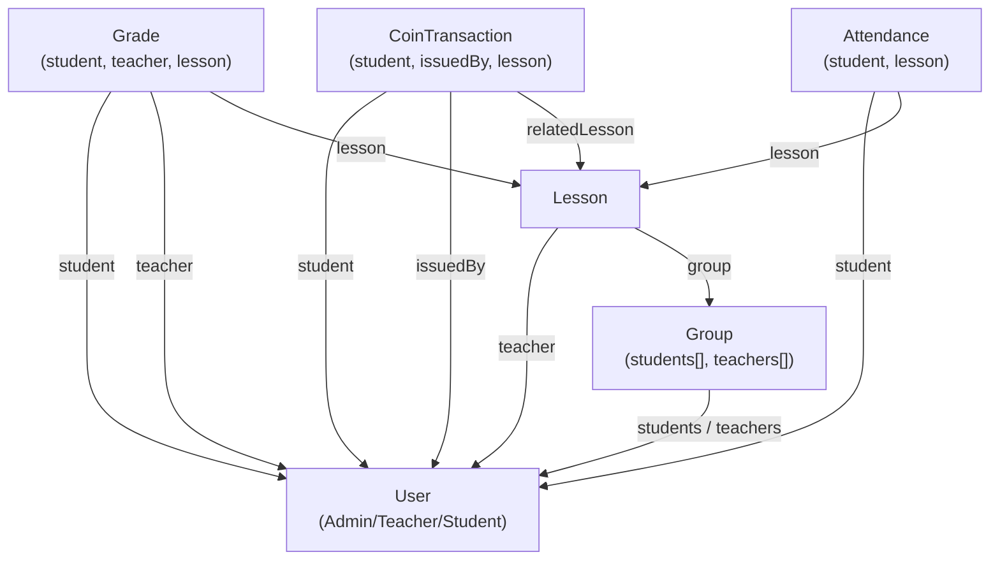

# Технічне Завдання: IT Academy LMS
### Навчальна LMS-система для управління навчальним процесом в IT-академії

> **Версія:** 1.0 | **Команда:** 5 студентів | **Стек:** React · Express · MongoDB · ShadCN UI · Tailwind CSS

---

## ЗМІСТ

1. [Загальний опис проекту](#1-загальний-опис)
2. [Ролі та права доступу](#2-ролі-та-права-доступу)
3. [Архітектура бази даних (MongoDB Schemas)](#3-архітектура-бази-даних)
4. [Backend API — Endpoints](#4-backend-api)
5. [Frontend — Структура компонентів](#5-frontend-компоненти)
6. [Концепція дизайну та UX](#6-концепція-дизайну)
7. [Roadmap — 6 тижнів](#7-roadmap)
8. [Розподіл задач у команді](#8-розподіл-задач)

---

## 1. Загальний опис

**Назва:** IT Academy LMS  
**Мета:** Єдина платформа для обліку студентів, управління розкладом, ведення журналу успішності та мотивації через внутрішню валюту **RedCoins**.

### Технологічний стек

| Рівень | Технологія |
|--------|-----------|
| Frontend | React 18 + Vite |
| UI Kit | ShadCN UI + Tailwind CSS |
| Форми | Formik + Yup |
| State | Zustand |
| Backend | Node.js + Express 5 |
| База даних | MongoDB + Mongoose |
| Автентифікація | JWT (access + refresh tokens) |
| Хмара (опц.) | Cloudinary (аватари) |

---

## 2. Ролі та права доступу

### Матриця прав

| Дія | Адмін | Викладач | Студент |
|-----|-------|----------|---------|
| Створити/видалити користувача | ✅ | ❌ | ❌ |
| Переглянути всіх студентів | ✅ | ✅ | ❌ |
| Редагувати профіль будь-кого | ✅ | ❌ | ❌ |
| Редагувати свій профіль | ✅ | ✅ | ✅ |
| Створити заняття | ✅ | тільки своє | ❌ |
| Редагувати/видалити заняття | ✅ | тільки своє | ❌ |
| Переглянути розклад | ✅ | тільки свої | тільки свої |
| Виставити оцінку | ✅ | ✅ | ❌ |
| Переглянути оцінки | ✅ | ✅ | тільки свої |
| Нарахувати RedCoins | ✅ | ✅ | ❌ |
| Переглянути баланс | ✅ | ✅ | тільки свій |
| Налаштування системи | ✅ | ❌ | ❌ |

---

## 3. Архітектура бази даних

### 3.1 Schema: User

```javascript
// models/User.js
const UserSchema = new Schema({
  firstName:    { type: String, required: true, trim: true },
  lastName:     { type: String, required: true, trim: true },
  email:        { type: String, required: true, unique: true, lowercase: true },
  passwordHash: { type: String, required: true },
  role:         { type: String, enum: ['admin', 'teacher', 'student'], required: true },
  avatar:       { type: String, default: null },          // URL або base64
  phone:        { type: String, default: null },
  redCoins:     { type: Number, default: 0, min: 0 },    // тільки для студентів
  group:        { type: Schema.Types.ObjectId, ref: 'Group', default: null },
  isActive:     { type: Boolean, default: true },
  createdAt:    { type: Date, default: Date.now },
}, { timestamps: true });

UserSchema.index({ email: 1 });
UserSchema.index({ role: 1 });
```

### 3.2 Schema: Group

```javascript
// models/Group.js
const GroupSchema = new Schema({
  name:        { type: String, required: true, unique: true },  // напр. "JS-2024-A"
  description: { type: String, default: '' },
  teachers:    [{ type: Schema.Types.ObjectId, ref: 'User' }],
  students:    [{ type: Schema.Types.ObjectId, ref: 'User' }],
  startDate:   { type: Date },
  endDate:     { type: Date },
  isActive:    { type: Boolean, default: true },
}, { timestamps: true });
```

### 3.3 Schema: Lesson

```javascript
// models/Lesson.js
const LessonSchema = new Schema({
  title:       { type: String, required: true },
  description: { type: String, default: '' },
  teacher:     { type: Schema.Types.ObjectId, ref: 'User', required: true },
  group:       { type: Schema.Types.ObjectId, ref: 'Group', required: true },
  date:        { type: Date, required: true },
  duration:    { type: Number, default: 80 },              // хвилини
  type:        { type: String, enum: ['lecture', 'practice', 'exam', 'consultation'] },
  status:      { type: String, enum: ['scheduled', 'completed', 'cancelled'], default: 'scheduled' },
  materials:   [{ title: String, url: String }],
  homework:    { description: String, dueDate: Date },
}, { timestamps: true });
```

### 3.4 Schema: Grade (Журнал успішності)

```javascript
// models/Grade.js
const GradeSchema = new Schema({
  student: { type: Schema.Types.ObjectId, ref: 'User', required: true },
  lesson:  { type: Schema.Types.ObjectId, ref: 'Lesson', required: true },
  teacher: { type: Schema.Types.ObjectId, ref: 'User', required: true },
  value:   { type: Number, min: 1, max: 12, required: true },  // 12-бальна шкала
  type:    { type: String, enum: ['homework', 'classwork', 'exam', 'project'], required: true },
  comment: { type: String, default: '' },
  date:    { type: Date, default: Date.now },
}, { timestamps: true });

// Унікальний індекс: один тип оцінки за заняття на студента
GradeSchema.index({ student: 1, lesson: 1, type: 1 }, { unique: true });
```

### 3.5 Schema: CoinTransaction (RedCoins)

```javascript
// models/CoinTransaction.js
const CoinTransactionSchema = new Schema({
  student:     { type: Schema.Types.ObjectId, ref: 'User', required: true },
  issuedBy:    { type: Schema.Types.ObjectId, ref: 'User', required: true },  // teacher/admin
  amount:      { type: Number, required: true },  // + нарахування, - списання
  reason:      { type: String, required: true },  // "Відмінна відповідь на уроці"
  category:    { type: String, enum: ['achievement', 'homework', 'activity', 'bonus', 'penalty'] },
  relatedLesson: { type: Schema.Types.ObjectId, ref: 'Lesson', default: null },
  date:        { type: Date, default: Date.now },
}, { timestamps: true });
```

### 3.6 Schema: Attendance

```javascript
// models/Attendance.js
const AttendanceSchema = new Schema({
  lesson:  { type: Schema.Types.ObjectId, ref: 'Lesson', required: true },
  student: { type: Schema.Types.ObjectId, ref: 'User', required: true },
  status:  { type: String, enum: ['present', 'absent', 'late', 'excused'], default: 'present' },
  note:    { type: String, default: '' },
}, { timestamps: true });

AttendanceSchema.index({ lesson: 1, student: 1 }, { unique: true });
```

### Діаграма зв'язків



---

## 4. Backend API

### Базовий URL: `/api/v1`

### 4.1 Auth Routes

```
POST   /auth/register       — реєстрація (тільки admin може реєструвати)
POST   /auth/login          — вхід, повертає { accessToken, refreshToken }
POST   /auth/refresh        — оновлення access token
POST   /auth/logout         — вихід (інвалідація refresh token)
GET    /auth/me             — дані поточного користувача
PATCH  /auth/me/password    — зміна пароля
```

### 4.2 Users Routes

```
GET    /users               — список (admin: всі; teacher: студенти своїх груп)
POST   /users               — створити користувача [admin]
GET    /users/:id           — профіль користувача
PATCH  /users/:id           — оновити профіль [admin | власний профіль]
DELETE /users/:id           — деактивувати [admin]
GET    /users/:id/stats     — статистика: оцінки, coins, відвідуваність
```

### 4.3 Groups Routes

```
GET    /groups              — всі групи
POST   /groups              — створити групу [admin]
GET    /groups/:id          — деталі групи + списки студентів/вчителів
PATCH  /groups/:id          — оновити групу [admin]
DELETE /groups/:id          — видалити/деактивувати [admin]
POST   /groups/:id/students — додати студента до групи [admin]
DELETE /groups/:id/students/:studentId — видалити студента [admin]
```

### 4.4 Lessons Routes

```
GET    /lessons             — список занять (фільтр: ?groupId=&teacherId=&from=&to=)
POST   /lessons             — створити заняття [admin, teacher]
GET    /lessons/:id         — деталі заняття
PATCH  /lessons/:id         — оновити [admin | teacher-owner]
DELETE /lessons/:id         — видалити [admin | teacher-owner]
POST   /lessons/:id/complete — позначити як проведене + масова явка
```

### 4.5 Grades Routes

```
GET    /grades              — оцінки (фільтр: ?studentId=&lessonId=&groupId=)
POST   /grades              — виставити оцінку [admin, teacher]
POST   /grades/bulk         — масове виставлення (для всієї групи за заняття)
PATCH  /grades/:id          — редагувати оцінку [admin, teacher-who-issued]
DELETE /grades/:id          — видалити [admin]
```

**Body для POST /grades/bulk:**
```json
{
  "lessonId": "...",
  "type": "classwork",
  "grades": [
    { "studentId": "...", "value": 10, "comment": "Добре" },
    { "studentId": "...", "value": 8,  "comment": "" }
  ]
}
```

### 4.6 Coins Routes

```
GET    /coins/transactions          — список транзакцій (?studentId=)
POST   /coins/transactions          — нарахувати/списати монети [admin, teacher]
GET    /coins/leaderboard           — топ студентів за монетами (?groupId=)
GET    /coins/students/:id/balance  — баланс конкретного студента
```

### 4.7 Attendance Routes

```
GET    /attendance          — явка (?lessonId=&studentId=)
POST   /attendance/bulk     — масова явка для заняття [teacher, admin]
PATCH  /attendance/:id      — змінити статус
```

### Middleware

```javascript
// Порядок middleware для захищених routes:
router.use(authenticate)         // перевірка JWT
router.use(authorize(['admin'])) // перевірка ролі

// Приклад:
router.post('/users', authenticate, authorize(['admin']), createUser);
router.get('/users/:id/stats', authenticate, canAccessUserStats, getUserStats);
```

---

## 5. Frontend — Структура компонентів

### 5.1 Файлова структура

```
src/
├── api/                        # axios instance + API функції
│   ├── axios.js                # базовий клієнт з interceptors
│   ├── auth.api.js
│   ├── users.api.js
│   ├── lessons.api.js
│   ├── grades.api.js
│   └── coins.api.js
│
├── components/
│   ├── ui/                     # перевикористовувані UI-примітиви (ShadCN)
│   │   ├── Button/
│   │   ├── Input/
│   │   ├── Modal/
│   │   ├── Table/
│   │   ├── Badge/
│   │   ├── Avatar/
│   │   ├── CoinBadge/          # відображення монет (🪙 +10)
│   │   └── GradeCell/          # клітинка журналу
│   │
│   ├── layout/
│   │   ├── AppLayout.jsx       # основний layout з sidebar
│   │   ├── Sidebar.jsx         # навігація (адаптивна)
│   │   ├── Header.jsx          # topbar з аватаром і нотифікаціями
│   │   └── MobileNav.jsx       # bottom nav для мобайлу
│   │
│   ├── features/               # feature-based компоненти
│   │   ├── auth/
│   │   │   ├── LoginForm.jsx
│   │   │   └── ProtectedRoute.jsx
│   │   │
│   │   ├── users/
│   │   │   ├── UserCard.jsx
│   │   │   ├── UserTable.jsx
│   │   │   ├── UserForm.jsx    # Formik/Zod форма
│   │   │   ├── UserStats.jsx
│   │   │   └── UserFilters.jsx
│   │   │
│   │   ├── groups/
│   │   │   ├── GroupCard.jsx
│   │   │   ├── GroupList.jsx
│   │   │   └── GroupForm.jsx
│   │   │
│   │   ├── lessons/
│   │   │   ├── LessonCalendar.jsx   # react-big-calendar або FullCalendar
│   │   │   ├── LessonCard.jsx
│   │   │   ├── LessonForm.jsx
│   │   │   └── LessonDetails.jsx
│   │   │
│   │   ├── grades/
│   │   │   ├── GradeJournal.jsx     # таблиця-журнал (ключовий компонент)
│   │   │   ├── GradeCell.jsx        # клітинка для inline-редагування
│   │   │   ├── BulkGradeForm.jsx    # масове виставлення
│   │   │   └── StudentGrades.jsx    # вид студента
│   │   │
│   │   └── coins/
│   │       ├── CoinBalance.jsx
│   │       ├── CoinHistory.jsx
│   │       ├── IssueCoinForm.jsx
│   │       └── CoinLeaderboard.jsx
│
├── pages/                      # Route-level компоненти
│   ├── LoginPage.jsx
│   ├── DashboardPage.jsx       # головна (адаптована під роль)
│   ├── StudentsPage.jsx
│   ├── TeachersPage.jsx
│   ├── GroupsPage.jsx
│   ├── SchedulePage.jsx
│   ├── GradesJournalPage.jsx
│   ├── CoinsPage.jsx
│   ├── ProfilePage.jsx
│   └── NotFoundPage.jsx
│
├── hooks/
│   ├── useAuth.js              # контекст автентифікації
│   ├── useUsers.js             # React Query хуки
│   ├── useLessons.js
│   ├── useGrades.js
│   └── useCoins.js
│
├── store/                      # Zustand stores
│   ├── authStore.js
│   └── uiStore.js              # sidebar open/close, theme
│
├── utils/
│   ├── formatDate.js
│   ├── gradeColor.js           # колір оцінки (1-4 red, 5-7 yellow, 8-12 green)
│   └── roleGuard.js
│
└── router/
    ├── index.jsx               # React Router v6
    └── routes.js               # конфіг роутів за ролями
```

### 5.2 Ключовий компонент: GradeJournal

```jsx
// Журнал — це таблиця де:
// Рядки = студенти
// Колонки = заняття (відсортовані за датою)
// Клітинки = оцінки (клікабельні для inline-редагування)

<GradeJournal>
  <TableHeader>
    <th>Студент</th>
    {lessons.map(lesson => <th key={lesson._id}>{formatDate(lesson.date)}</th>)}
    <th>Середнє</th>
  </TableHeader>
  <TableBody>
    {students.map(student => (
      <tr key={student._id}>
        <td><UserCell user={student} /></td>
        {lessons.map(lesson => (
          <GradeCell
            key={lesson._id}
            grade={getGrade(student._id, lesson._id)}
            editable={canEdit}
            onSave={(value) => saveGrade(student._id, lesson._id, value)}
          />
        ))}
        <td><AvgBadge value={calcAvg(student._id)} /></td>
      </tr>
    ))}
  </TableBody>
</GradeJournal>
```

---

## 6. Концепція дизайну

### 6.1 Дизайн-система

**Кольорова палітра:**
- Primary: `#E63946` (Red — RedCoins brand)
- Secondary: `#457B9D` (Blue)
- Surface: `#F8F9FA` (Light background)
- Dark: `#1D3557` (Headers, sidebar)
- Success: `#2D6A4F`
- Warning: `#E9C46A`
- Danger: `#E76F51`

**Типографіка:** Inter (Google Fonts) — читабельний, сучасний

**Border radius:** 8px (компоненти), 12px (картки), 16px (модалки)

### 6.2 Структура екранів

#### Екран: Login
- Центрована форма, логотип академії
- Email + Password + "Увійти"
- Адаптивна (мобайл — full screen)

#### Екран: Dashboard (головна)
- **Admin view:** Статистика (кількість студентів/груп/занять), останні дії, швидкі посилання
- **Teacher view:** Сьогоднішні заняття, студенти без оцінок, топ по монетах
- **Student view:** Свої оцінки (останні 5), баланс RedCoins, найближче заняття

#### Екран: Студенти (Адмін/Викладач)
- Таблиця або сітка карток
- Фільтр по групі, пошук по імені
- Кнопка "Додати студента" (тільки admin)
- Клік → профіль студента

#### Екран: Розклад (Календар)
- Вид: місяць / тиждень / день (перемикач)
- Кольорові плашки занять по типу (lecture=blue, exam=red, practice=green)
- Клік на заняття → деталі + список студентів

#### Екран: Журнал оцінок
- Вибір групи + тип оцінки (classwork/homework/exam)
- Таблиця-журнал з inline-редагуванням
- Кнопка "Виставити масово" → Drawer/Modal зі списком
- Кольорове кодування: 10-12 зелений, 7-9 синій, 4-6 жовтий, 1-3 червоний

#### Екран: RedCoins
- **Для teacher/admin:** Список студентів з балансами + форма нарахування
- **Для student:** Баланс + Leaderboard групи + Історія транзакцій

### 6.3 Навігація

```
Sidebar (desktop, 240px):
├── 🏠 Dashboard
├── 👥 Студенти
├── 👨‍🏫 Викладачі          [admin]
├── 🏫 Групи               [admin]
├── 📅 Розклад
├── 📊 Журнал оцінок
├── 🪙 RedCoins
└── ⚙️  Налаштування        [admin]

Bottom Navigation (mobile):
├── 🏠 Головна
├── 📅 Розклад
├── 📊 Оцінки
└── 🪙 Монети
```

### 6.4 Зручне виставлення оцінок (UX деталь)

**Inline editing в журналі:**
1. Клік на порожню клітинку → відкривається попап з числовим полем (1-12) + тип
2. Натиск Enter або Tab — зберегти і перейти до наступного
3. Escape — скасувати
4. Hover показує підказку з деталями оцінки (хто/коли)

**Bulk mode:**
1. Кнопка "Виставити класну роботу" відкриває drawer
2. Список усіх студентів групи з полями оцінки
3. Можливість "Поставити всім X" — автозаповнення
4. Одна кнопка "Зберегти все" — один POST /grades/bulk

---

## 7. Roadmap — 6 тижнів

### Тиждень 1: Основа проекту

**Backend:**
- [ ] Ініціалізація Express + MongoDB + Mongoose
- [ ] User Schema + Auth (register/login/JWT)
- [ ] Middleware: authenticate, authorize
- [ ] Group Schema + CRUD

**Frontend:**
- [ ] Vite + React + Tailwind + ShadCN setup
- [ ] Роутер (React Router v6) з ProtectedRoute
- [ ] AppLayout (Sidebar + Header)
- [ ] LoginPage + форма (Zod validation)
- [ ] Axios клієнт з interceptors для токенів

**Результат:** Можна зайти в систему, бачити sidebar.

---

### Тиждень 2: Управління користувачами

**Backend:**
- [ ] Users API (CRUD + фільтрація)
- [ ] Groups API (CRUD + додавання студентів)
- [ ] Seed script (тестові дані)

**Frontend:**
- [ ] StudentsPage + UserTable
- [ ] UserForm (Formik/Zod)
- [ ] GroupsPage + GroupForm
- [ ] Профіль користувача

**Результат:** Адмін може додавати студентів та групи.

---

### Тиждень 3: Розклад занять

**Backend:**
- [ ] Lessons Schema + CRUD API
- [ ] Attendance Schema + bulk-attendance endpoint
- [ ] Фільтрація занять за датою/групою/викладачем

**Frontend:**
- [ ] SchedulePage + Calendar (react-big-calendar)
- [ ] LessonForm (модалка)
- [ ] LessonDetails з відвідуваністю
- [ ] Dashboard з найближчими заняттями

**Результат:** Викладач бачить свій розклад і може додавати заняття.

---

### Тиждень 4: Журнал успішності

**Backend:**
- [ ] Grades Schema + CRUD
- [ ] POST /grades/bulk endpoint
- [ ] Агрегація: середня оцінка студента

**Frontend:**
- [ ] GradeJournalPage (ключовий!!)
- [ ] GradeCell з inline-editing
- [ ] BulkGradeForm (Drawer)
- [ ] StudentGrades (вид студента)

**Результат:** Викладач може виставляти оцінки, студент — переглядати свої.

---

### Тиждень 5: RedCoins + Дашборд

**Backend:**
- [ ] CoinTransaction Schema + API
- [ ] Leaderboard агрегація
- [ ] Stats endpoint для дашборду

**Frontend:**
- [ ] CoinsPage (нарахування + баланс)
- [ ] CoinLeaderboard
- [ ] CoinHistory (транзакції)
- [ ] DashboardPage (різний контент за роллю)
- [ ] Нотифікації (toast) при нарахуванні монет

**Результат:** Повна гейміфікація, адаптований Dashboard.

---

### Тиждень 6: Полірування та здача

- [ ] Адаптивність (мобайл breakpoints, Bottom Nav)
- [ ] Error handling (404, 403, Network errors)
- [ ] Loading states + Skeleton UI
- [ ] Empty states (порожні списки)
- [ ] Оптимізація (React Query caching, індекси MongoDB)
- [ ] README.md з інструкцією запуску
- [ ] Демо-дані для презентації
- [ ] Код-рев'ю та фікс bagів

---

## 8. Розподіл задач у команді

### Git Flow

```
main              — основна розробка
task/...          — гілки завдань (на кожне завдання нова гілка)
```

### Пріоритети MVP (Мінімально Життєздатний Продукт)

**Must have (тижні 1-4):**
- Автентифікація з ролями
- CRUD студентів та груп
- Журнал оцінок з inline-editing
- Розклад (список + Calendar)

**Should have (тижень 5):**
- RedCoins система
- Дашборд по ролях

**Nice to have (тиждень 6):**
- Аватари (Cloudinary)
- Експорт журналу в PDF/Excel
- Email нотифікації (Nodemailer)
- Dark mode

---

## Додаток: Приклад валідації (Zod)

```typescript
// schemas/lesson.schema.ts
import { z } from 'zod';

export const createLessonSchema = z.object({
  title:       z.string().min(3, 'Мінімум 3 символи').max(100),
  description: z.string().max(500).optional(),
  teacherId:   z.string().regex(/^[0-9a-fA-F]{24}$/, 'Невалідний ID'),
  groupId:     z.string().regex(/^[0-9a-fA-F]{24}$/, 'Невалідний ID'),
  date:        z.string().datetime('Невалідна дата'),
  duration:    z.number().min(30).max(480).default(90),
  type:        z.enum(['lecture', 'practice', 'exam', 'consultation']),
});

export const bulkGradeSchema = z.object({
  lessonId: z.string(),
  type:     z.enum(['homework', 'classwork', 'exam', 'project']),
  grades:   z.array(z.object({
    studentId: z.string(),
    value:     z.number().min(1).max(12),
    comment:   z.string().max(200).optional(),
  })).min(1),
});
```

---

*Документ підготовлено для команди розробки IT Academy LMS. Версія 1.0*
