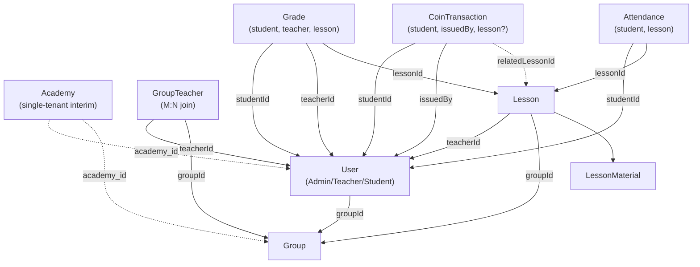

# Технічне Завдання: IT Academy LMS
### Навчальна LMS-система для управління навчальним процесом в IT-академії

> **Версія:** 1.1 | **Команда:** 5 студентів | **Стек:** React · Express · PostgreSQL (Prisma) · ShadCN UI · Tailwind CSS

---

## ЗМІСТ

1. [Загальний опис проекту](#1-загальний-опис)
2. [Ролі та права доступу](#2-ролі-та-права-доступу)
3. [Архітектура бази даних (PostgreSQL / Prisma Schema)](#3-архітектура-бази-даних)
4. [Backend API — Endpoints](#4-backend-api)
5. [Frontend — Структура компонентів](#5-frontend-компоненти)
6. [Концепція дизайну та UX](#6-концепція-дизайну)
7. [Roadmap — 6 тижнів](#7-roadmap)
8. [Розподіл задач у команді](#8-розподіл-задач)

---

## 1. Загальний опис

**Назва:** IT Academy LMS
**Мета:** Єдина платформа для обліку студентів, управління розкладом, ведення журналу успішності та мотивації через внутрішню валюту **RedCoins**.

### Технологічний стек

| Рівень | Технологія |
|--------|-----------|
| Frontend | React 19 + Vite |
| UI Kit | ShadCN UI + Tailwind CSS |
| Форми | Formik + Zod |
| State | Zustand |
| Backend | Node.js + Express 5 |
| База даних | PostgreSQL (хостинг [Neon](https://neon.tech)) + Prisma ORM |
| Автентифікація | Власний JWT (access + refresh tokens) |
| Хмара (опц.) | Cloudinary (аватари) |

---

## 2. Ролі та права доступу

### Матриця прав

| Дія | Адмін | Викладач | Студент |
|-----|-------|----------|---------|
| Створити/видалити користувача | ✅ | ❌ | ❌ |
| Переглянути всіх студентів | ✅ | ✅ | ❌ |
| Редагувати профіль будь-кого | ✅ | ❌ | ❌ |
| Редагувати свій профіль | ✅ | ✅ | ✅ |
| Створити заняття | ✅ | тільки своє | ❌ |
| Редагувати/видалити заняття | ✅ | тільки своє | ❌ |
| Переглянути розклад | ✅ | тільки свої | тільки свої |
| Виставити оцінку | ✅ | ✅ | ❌ |
| Переглянути оцінки | ✅ | ✅ | тільки свої |
| Нарахувати RedCoins | ✅ | ✅ | ❌ |
| Переглянути баланс | ✅ | ✅ | тільки свій |
| Налаштування системи | ✅ | ❌ | ❌ |

---

## 3. Архітектура бази даних

> База даних — **PostgreSQL**, доступ через **Prisma ORM**. Джерело істини для схеми — [`backend/prisma/schema.prisma`](../backend/prisma/schema.prisma); нижче наведено спрощений опис для орієнтування. Кожна таблиця має `academy_id` (готовність до майбутньої мульти-тенантності — зараз в системі рівно одна академія) та `id uuid` замість Mongo `ObjectId`.

### 3.1 Model: User

```prisma
model User {
  id           String   @id @default(uuid())
  academyId    String
  firstName    String
  lastName     String
  email        String
  passwordHash String
  role         UserRole // admin | teacher | student
  avatar       String?
  phone        String?
  redCoins     Int      @default(0)   // тільки для студентів
  tokenVersion Int      @default(0)   // інкремент на logout → відкликає refresh-токени
  groupId      String?
  isActive     Boolean  @default(true)

  @@unique([academyId, email])
}
```

### 3.2 Model: Group + GroupTeacher

Студенти належать групі через `User.groupId` (1:N). Викладачі прив'язані до груп через join-таблицю `GroupTeacher` (M:N — один викладач може вести кілька груп і навпаки; у Mongo-варіанті це був масив `Group.teachers[]`).

```prisma
model Group {
  id          String    @id @default(uuid())
  academyId   String
  name        String    // напр. "JS-2024-A"
  description String    @default("")
  startDate   DateTime?
  endDate     DateTime?
  isActive    Boolean   @default(true)

  @@unique([academyId, name])
}

model GroupTeacher {
  groupId   String
  teacherId String
  academyId String

  @@id([groupId, teacherId])
}
```

### 3.3 Model: Lesson + LessonMaterial

Матеріали заняття — окрема таблиця `LessonMaterial` (1:N), не вбудований масив.

```prisma
model Lesson {
  id                  String       @id @default(uuid())
  academyId           String
  teacherId           String
  groupId             String
  title               String
  description         String       @default("")
  date                DateTime
  duration            Int          @default(80)   // хвилини
  type                LessonType   // lecture | practice | exam | consultation
  status              LessonStatus @default(scheduled) // scheduled | completed | cancelled
  homeworkDescription String?
  homeworkDueDate     DateTime?
}

model LessonMaterial {
  id       String @id @default(uuid())
  lessonId String
  title    String
  url      String
  position Int    @default(0)
}
```

### 3.4 Model: Grade (Журнал успішності)

```prisma
model Grade {
  id        String    @id @default(uuid())
  academyId String
  studentId String
  lessonId  String
  teacherId String
  value     Int       @db.SmallInt // 1..12, валідація на рівні застосунку (не CHECK у БД)
  type      GradeType // homework | classwork | exam | project
  comment   String?

  @@unique([studentId, lessonId, type]) // один тип оцінки за заняття на студента
}
```

### 3.5 Model: CoinTransaction (RedCoins)

Append-only ledger: баланс `User.redCoins` оновлюється в тій самій транзакції, що й запис у `CoinTransaction`.

```prisma
model CoinTransaction {
  id              String       @id @default(uuid())
  academyId       String
  studentId       String
  issuedBy        String       // teacher/admin
  amount          Int          // + нарахування, - списання (не 0, валідація на рівні застосунку)
  reason          String       // "Відмінна відповідь на уроці"
  category        CoinCategory // achievement | homework | activity | bonus | penalty
  relatedLessonId String?
  createdAt       DateTime     @default(now())
}
```

### 3.6 Model: Attendance

```prisma
model Attendance {
  id        String           @id @default(uuid())
  academyId String
  lessonId  String
  studentId String
  status    AttendanceStatus @default(present) // present | absent | late | excused
  note      String           @default("")

  @@unique([lessonId, studentId])
}
```

### Діаграма зв'язків


```mermaid
flowchart TD
    Academy["Academy\n(single-tenant interim)"]
    User["User\n(Admin/Teacher/Student)"]
    Group["Group"]
    GroupTeacher["GroupTeacher\n(M:N join)"]
    Lesson["Lesson"]
    LessonMaterial["LessonMaterial"]
    Grade["Grade\n(student, teacher, lesson)"]
    CoinTransaction["CoinTransaction\n(student, issuedBy, lesson?)"]
    Attendance["Attendance\n(student, lesson)"]

    Academy -.->|academy_id| User
    Academy -.->|academy_id| Group

    User -->|groupId| Group
    GroupTeacher -->|teacherId| User
    GroupTeacher -->|groupId| Group

    Lesson -->|teacherId| User
    Lesson -->|groupId| Group
    Lesson --> LessonMaterial

    Grade -->|studentId| User
    Grade -->|teacherId| User
    Grade -->|lessonId| Lesson

    CoinTransaction -->|studentId| User
    CoinTransaction -->|issuedBy| User
    CoinTransaction -.->|relatedLessonId| Lesson

    Attendance -->|studentId| User
    Attendance -->|lessonId| Lesson
```

---

## 4. Backend API

### Базовий URL: `/api/v1`

### 4.1 Auth Routes

```
POST   /auth/register       — реєстрація (тільки admin може реєструвати)
POST   /auth/login          — вхід, повертає { accessToken, refreshToken }
POST   /auth/refresh        — оновлення access token
POST   /auth/logout         — вихід (інвалідація refresh token)
GET    /auth/me             — дані поточного користувача
PATCH  /auth/me/password    — зміна пароля
```

### 4.2 Users Routes

```
GET    /users               — список (admin: всі; teacher: студенти своїх груп)
POST   /users               — створити користувача [admin]
GET    /users/:id           — профіль користувача
PATCH  /users/:id           — оновити профіль [admin | власний профіль]
DELETE /users/:id           — деактивувати [admin]
GET    /users/:id/stats     — статистика: оцінки, coins, відвідуваність
```

### 4.3 Groups Routes

```
GET    /groups              — всі групи
POST   /groups              — створити групу [admin]
GET    /groups/:id          — деталі групи + списки студентів/вчителів
PATCH  /groups/:id          — оновити групу [admin]
DELETE /groups/:id          — видалити/деактивувати [admin]
POST   /groups/:id/students — додати студента до групи [admin]
DELETE /groups/:id/students/:studentId — видалити студента [admin]
```

### 4.4 Lessons Routes

```
GET    /lessons             — список занять (фільтр: ?groupId=&teacherId=&from=&to=)
POST   /lessons             — створити заняття [admin, teacher]
GET    /lessons/:id         — деталі заняття
PATCH  /lessons/:id         — оновити [admin | teacher-owner]
DELETE /lessons/:id         — видалити [admin | teacher-owner]
POST   /lessons/:id/complete — позначити як проведене + масова явка
```

### 4.5 Grades Routes

```
GET    /grades              — оцінки (фільтр: ?studentId=&lessonId=&groupId=)
POST   /grades              — виставити оцінку [admin, teacher]
POST   /grades/bulk         — масове виставлення (для всієї групи за заняття)
PATCH  /grades/:id          — редагувати оцінку [admin, teacher-who-issued]
DELETE /grades/:id          — видалити [admin]
```

**Body для POST /grades/bulk:**
```json
{
  "lessonId": "...",
  "type": "classwork",
  "grades": [
    { "studentId": "...", "value": 10, "comment": "Добре" },
    { "studentId": "...", "value": 8,  "comment": "" }
  ]
}
```

### 4.6 Coins Routes

```
GET    /coins/transactions          — список транзакцій (?studentId=)
POST   /coins/transactions          — нарахувати/списати монети [admin, teacher]
GET    /coins/leaderboard           — топ студентів за монетами (?groupId=)
GET    /coins/students/:id/balance  — баланс конкретного студента
```

### 4.7 Attendance Routes

```
GET    /attendance          — явка (?lessonId=&studentId=)
POST   /attendance/bulk     — масова явка для заняття [teacher, admin]
PATCH  /attendance/:id      — змінити статус
```

### Middleware

```javascript
// Порядок middleware для захищених routes:
router.use(authenticate)         // перевірка JWT
router.use(authorize(['admin'])) // перевірка ролі

// Приклад:
router.post('/users', authenticate, authorize(['admin']), createUser);
router.get('/users/:id/stats', authenticate, canAccessUserStats, getUserStats);
```

---

## 5. Frontend — Структура компонентів

### 5.1 Файлова структура

```
src/
├── api/                        # axios instance + API функції
│   ├── axios.js                # базовий клієнт з interceptors
│   ├── auth.api.js
│   ├── users.api.js
│   ├── lessons.api.js
│   ├── grades.api.js
│   └── coins.api.js
│
├── components/
│   ├── ui/                     # перевикористовувані UI-примітиви (ShadCN)
│   │   ├── Button/
│   │   ├── Input/
│   │   ├── Modal/
│   │   ├── Table/
│   │   ├── Badge/
│   │   ├── Avatar/
│   │   ├── CoinBadge/          # відображення монет (🪙 +10)
│   │   └── GradeCell/          # клітинка журналу
│   │
│   ├── layout/
│   │   ├── AppLayout.jsx       # основний layout з sidebar
│   │   ├── Sidebar.jsx         # навігація (адаптивна)
│   │   ├── Header.jsx          # topbar з аватаром і нотифікаціями
│   │   └── MobileNav.jsx       # bottom nav для мобайлу
│   │
│   ├── features/               # feature-based компоненти
│   │   ├── auth/
│   │   │   ├── LoginForm.jsx
│   │   │   └── ProtectedRoute.jsx
│   │   │
│   │   ├── users/
│   │   │   ├── UserCard.jsx
│   │   │   ├── UserTable.jsx
│   │   │   ├── UserForm.jsx    # Formik/Zod форма
│   │   │   ├── UserStats.jsx
│   │   │   └── UserFilters.jsx
│   │   │
│   │   ├── groups/
│   │   │   ├── GroupCard.jsx
│   │   │   ├── GroupList.jsx
│   │   │   └── GroupForm.jsx
│   │   │
│   │   ├── lessons/
│   │   │   ├── LessonCalendar.jsx   # react-big-calendar або FullCalendar
│   │   │   ├── LessonCard.jsx
│   │   │   ├── LessonForm.jsx
│   │   │   └── LessonDetails.jsx
│   │   │
│   │   ├── grades/
│   │   │   ├── GradeJournal.jsx     # таблиця-журнал (ключовий компонент)
│   │   │   ├── GradeCell.jsx        # клітинка для inline-редагування
│   │   │   ├── BulkGradeForm.jsx    # масове виставлення
│   │   │   └── StudentGrades.jsx    # вид студента
│   │   │
│   │   └── coins/
│   │       ├── CoinBalance.jsx
│   │       ├── CoinHistory.jsx
│   │       ├── IssueCoinForm.jsx
│   │       └── CoinLeaderboard.jsx
│
├── pages/                      # Route-level компоненти
│   ├── LoginPage.jsx
│   ├── DashboardPage.jsx       # головна (адаптована під роль)
│   ├── StudentsPage.jsx
│   ├── TeachersPage.jsx
│   ├── GroupsPage.jsx
│   ├── SchedulePage.jsx
│   ├── GradesJournalPage.jsx
│   ├── CoinsPage.jsx
│   ├── ProfilePage.jsx
│   └── NotFoundPage.jsx
│
├── hooks/
│   ├── useAuth.js              # контекст автентифікації
│   ├── useUsers.js             # React Query хуки
│   ├── useLessons.js
│   ├── useGrades.js
│   └── useCoins.js
│
├── store/                      # Zustand stores
│   ├── authStore.js
│   └── uiStore.js              # sidebar open/close, theme
│
├── utils/
│   ├── formatDate.js
│   ├── gradeColor.js           # колір оцінки (1-4 red, 5-7 yellow, 8-12 green)
│   └── roleGuard.js
│
└── router/
    ├── index.jsx               # React Router v6
    └── routes.js               # конфіг роутів за ролями
```

### 5.2 Ключовий компонент: GradeJournal

```jsx
// Журнал — це таблиця де:
// Рядки = студенти
// Колонки = заняття (відсортовані за датою)
// Клітинки = оцінки (клікабельні для inline-редагування)

<GradeJournal>
  <TableHeader>
    <th>Студент</th>
    {lessons.map(lesson => <th key={lesson._id}>{formatDate(lesson.date)}</th>)}
    <th>Середнє</th>
  </TableHeader>
  <TableBody>
    {students.map(student => (
      <tr key={student._id}>
        <td><UserCell user={student} /></td>
        {lessons.map(lesson => (
          <GradeCell
            key={lesson._id}
            grade={getGrade(student._id, lesson._id)}
            editable={canEdit}
            onSave={(value) => saveGrade(student._id, lesson._id, value)}
          />
        ))}
        <td><AvgBadge value={calcAvg(student._id)} /></td>
      </tr>
    ))}
  </TableBody>
</GradeJournal>
```

---

## 6. Концепція дизайну

### 6.1 Дизайн-система

**Кольорова палітра:**
- Primary: `#E63946` (Red — RedCoins brand)
- Secondary: `#457B9D` (Blue)
- Surface: `#F8F9FA` (Light background)
- Dark: `#1D3557` (Headers, sidebar)
- Success: `#2D6A4F`
- Warning: `#E9C46A`
- Danger: `#E76F51`

**Типографіка:** Inter (Google Fonts) — читабельний, сучасний

**Border radius:** 8px (компоненти), 12px (картки), 16px (модалки)

### 6.2 Структура екранів

#### Екран: Login
- Центрована форма, логотип академії
- Email + Password + "Увійти"
- Адаптивна (мобайл — full screen)

#### Екран: Dashboard (головна)
- **Admin view:** Статистика (кількість студентів/груп/занять), останні дії, швидкі посилання
- **Teacher view:** Сьогоднішні заняття, студенти без оцінок, топ по монетах
- **Student view:** Свої оцінки (останні 5), баланс RedCoins, найближче заняття

#### Екран: Студенти (Адмін/Викладач)
- Таблиця або сітка карток
- Фільтр по групі, пошук по імені
- Кнопка "Додати студента" (тільки admin)
- Клік → профіль студента

#### Екран: Розклад (Календар)
- Вид: місяць / тиждень / день (перемикач)
- Кольорові плашки занять по типу (lecture=blue, exam=red, practice=green)
- Клік на заняття → деталі + список студентів

#### Екран: Журнал оцінок
- Вибір групи + тип оцінки (classwork/homework/exam)
- Таблиця-журнал з inline-редагуванням
- Кнопка "Виставити масово" → Drawer/Modal зі списком
- Кольорове кодування: 10-12 зелений, 7-9 синій, 4-6 жовтий, 1-3 червоний

#### Екран: RedCoins
- **Для teacher/admin:** Список студентів з балансами + форма нарахування
- **Для student:** Баланс + Leaderboard групи + Історія транзакцій

### 6.3 Навігація

```
Sidebar (desktop, 240px):
├── 🏠 Dashboard
├── 👥 Студенти
├── 👨‍🏫 Викладачі          [admin]
├── 🏫 Групи               [admin]
├── 📅 Розклад
├── 📊 Журнал оцінок
├── 🪙 RedCoins
└── ⚙️  Налаштування        [admin]

Bottom Navigation (mobile):
├── 🏠 Головна
├── 📅 Розклад
├── 📊 Оцінки
└── 🪙 Монети
```

### 6.4 Зручне виставлення оцінок (UX деталь)

**Inline editing в журналі:**
1. Клік на порожню клітинку → відкривається попап з числовим полем (1-12) + тип
2. Натиск Enter або Tab — зберегти і перейти до наступного
3. Escape — скасувати
4. Hover показує підказку з деталями оцінки (хто/коли)

**Bulk mode:**
1. Кнопка "Виставити класну роботу" відкриває drawer
2. Список усіх студентів групи з полями оцінки
3. Можливість "Поставити всім X" — автозаповнення
4. Одна кнопка "Зберегти все" — один POST /grades/bulk

---

## 7. Roadmap — 6 тижнів

### Тиждень 1: Основа проекту

**Backend:**
- [x] Ініціалізація Express + PostgreSQL (Neon) + Prisma
- [x] User Model + Auth (login/JWT access+refresh)
- [x] Middleware: authenticate, authorize
- [x] Group Model + CRUD

**Frontend:**
- [x] Vite + React + Tailwind + ShadCN setup
- [x] Роутер (React Router v6) з ProtectedRoute
- [x] AppLayout (Sidebar + Header)
- [x] LoginPage + форма (Zod validation)
- [x] Axios клієнт з interceptors для токенів

**Результат:** Можна зайти в систему, бачити sidebar.

---

### Тиждень 2: Управління користувачами

**Backend:**
- [x] Users API (CRUD + фільтрація)
- [x] Groups API (CRUD + додавання студентів)
- [x] Seed script (тестові дані)

**Frontend:**
- [x] StudentsPage + UserTable
- [x] UserForm (Formik/Zod)
- [x] GroupsPage + GroupForm
- [x] Профіль користувача

**Результат:** Адмін може додавати студентів та групи.

---

### Тиждень 3: Розклад занять

**Backend:**
- [x] Lessons Schema + CRUD API
- [x] Attendance Schema + bulk-attendance endpoint
- [x] Фільтрація занять за датою/групою/викладачем

**Frontend:**
- [x] SchedulePage + Calendar (react-big-calendar)
- [x] LessonForm (модалка)
- [x] LessonDetails з відвідуваністю
- [x] Dashboard з найближчими заняттями

**Результат:** Викладач бачить свій розклад і може додавати заняття.

---

### Тиждень 4: Журнал успішності

**Backend:**
- [ ] Grades Schema + CRUD
- [ ] POST /grades/bulk endpoint
- [ ] Агрегація: середня оцінка студента

**Frontend:**
- [ ] GradeJournalPage (ключовий!!)
- [ ] GradeCell з inline-editing
- [ ] BulkGradeForm (Drawer)
- [ ] StudentGrades (вид студента)

**Результат:** Викладач може виставляти оцінки, студент — переглядати свої.

---

### Тиждень 5: RedCoins + Дашборд

**Backend:**
- [ ] CoinTransaction Schema + API
- [ ] Leaderboard агрегація
- [ ] Stats endpoint для дашборду

**Frontend:**
- [ ] CoinsPage (нарахування + баланс)
- [ ] CoinLeaderboard
- [ ] CoinHistory (транзакції)
- [ ] DashboardPage (різний контент за роллю)
- [ ] Нотифікації (toast) при нарахуванні монет

**Результат:** Повна гейміфікація, адаптований Dashboard.

---

### Тиждень 6: Полірування та здача

- [ ] Адаптивність (мобайл breakpoints, Bottom Nav)
- [ ] Error handling (404, 403, Network errors)
- [ ] Loading states + Skeleton UI
- [ ] Empty states (порожні списки)
- [ ] Оптимізація (React Query caching, індекси PostgreSQL)
- [x] README.md з інструкцією запуску
- [ ] Демо-дані для презентації
- [ ] Код-рев'ю та фікс bagів

---

## 8. Розподіл задач у команді

### Git Flow

Детальний опис гілок, коміт-конвенцій та workflow — у [CONTRIBUTING.md](../CONTRIBUTING.md). Коротко:

```
main               — стабільна продакшн-версія, прямі пуші заборонені
develop            — інтеграційна гілка, всі PR зливаються сюди
feature/...        — новий функціонал
fix/...            — виправлення помилки
chore/...          — конфіги, залежності
```

### Пріоритети MVP (Мінімально Життєздатний Продукт)

**Must have (тижні 1-4):**
- Автентифікація з ролями
- CRUD студентів та груп
- Журнал оцінок з inline-editing
- Розклад (список + Calendar)

**Should have (тижень 5):**
- RedCoins система
- Дашборд по ролях

**Nice to have (тиждень 6):**
- Аватари (Cloudinary)
- Експорт журналу в PDF/Excel
- Email нотифікації (Nodemailer)
- Dark mode

---

## Додаток: Приклад валідації (Zod)

```typescript
// schemas/lesson.schema.ts
import { z } from 'zod';

export const createLessonSchema = z.object({
  title:       z.string().min(3, 'Мінімум 3 символи').max(100),
  description: z.string().max(500).optional(),
  teacherId:   z.string().uuid('Невалідний ID'),
  groupId:     z.string().uuid('Невалідний ID'),
  date:        z.string().datetime('Невалідна дата'),
  duration:    z.number().min(30).max(480).default(90),
  type:        z.enum(['lecture', 'practice', 'exam', 'consultation']),
});

export const bulkGradeSchema = z.object({
  lessonId: z.string(),
  type:     z.enum(['homework', 'classwork', 'exam', 'project']),
  grades:   z.array(z.object({
    studentId: z.string(),
    value:     z.number().min(1).max(12),
    comment:   z.string().max(200).optional(),
  })).min(1),
});
```

---

*Документ підготовлено для команди розробки IT Academy LMS. Версія 1.1 — оновлено після міграції на PostgreSQL/Prisma.*
