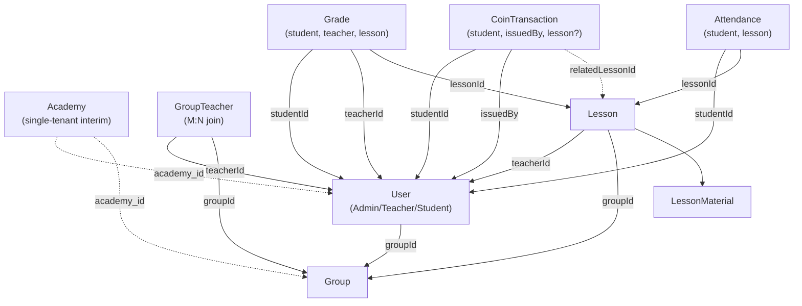

# Технічне Завдання: IT Academy LMS
### Навчальна LMS-система для управління навчальним процесом в IT-академії

> **Версія:** 1.2 | **Команда:** 5 студентів | **Стек:** React · Express · PostgreSQL (Prisma) · ShadCN UI · Tailwind CSS · TypeScript

---

## ЗМІСТ

1. [Загальний опис проекту](#1-загальний-опис)
2. [Ролі та права доступу](#2-ролі-та-права-доступу)
3. [Архітектура бази даних (PostgreSQL / Prisma Schema)](#3-архітектура-бази-даних)
4. [Backend API — Endpoints](#4-backend-api)
5. [Frontend — Структура компонентів](#5-frontend--структура-компонентів)
6. [Концепція дизайну та UX](#6-концепція-дизайну)
7. [Roadmap — 6 тижнів](#7-roadmap--6-тижнів)
8. [Розподіл задач у команді](#8-розподіл-задач-у-команді)

---

## 1. Загальний опис

**Назва:** IT Academy LMS
**Мета:** Єдина платформа для обліку студентів, управління розкладом, ведення журналу успішності та мотивації через внутрішню валюту **RedCoins**.

### Технологічний стек

| Рівень | Технологія |
|--------|-----------|
| Frontend | React 19 + Vite |
| UI Kit | ShadCN UI + Tailwind CSS |
| Форми | Formik + Zod |
| State | Zustand |
| Backend | Node.js + Express 5 |
| База даних | PostgreSQL (хостинг [Neon](https://neon.tech)) + Prisma ORM |
| Автентифікація | Власний JWT (access + refresh tokens) |
| Мова | TypeScript у frontend, backend і `shared` (спільні типи та Zod-схеми) |
| Тести | Vitest, Supertest, React Testing Library |
| Хмара (опц.) | Cloudinary (аватари) |

---

## 2. Ролі та права доступу

### Матриця прав

| Дія | Адмін | Викладач | Студент |
|-----|-------|----------|---------|
| Створити / деактивувати користувача | ✅ | ❌ | ❌ |
| Список студентів | ✅ | ✅ | ❌ |
| Профіль і статистика студента | ✅ | студентів своїх груп | тільки свої |
| Редагувати профіль будь-кого (роль, група, email, пароль) | ✅ | ❌ | ❌ |
| Редагувати свій профіль (ім'я, телефон, аватар, пароль) | ✅ | ✅ | ✅ |
| Створити / змінити / деактивувати групу | ✅ | ❌ | ❌ |
| Створити заняття | ✅ (для будь-якого викладача) | тільки своє | ❌ |
| Редагувати / скасувати / провести заняття | ✅ | тільки своє | ❌ |
| Переглянути розклад | ✅ | свої заняття й заняття своїх груп | своєї групи |
| Виставити оцінку, відмітити явку | ✅ | на своїх заняттях | ❌ |
| Редагувати оцінку | ✅ | тільки виставлену собою | ❌ |
| Видалити оцінку | ✅ | ❌ | ❌ |
| Переглянути оцінки | ✅ | своїх занять і груп | тільки свої |
| Нарахувати / списати RedCoins | ✅ | студентам своїх груп | ❌ |
| Переглянути баланс і історію монет | ✅ | студентів своїх груп | тільки свої |
| Рейтинг RedCoins | ✅ | ✅ | своєї групи |
| Налаштування системи | ✅ (поки сторінка-заглушка) | ❌ | ❌ |

Роль перевіряють маршрути (`authorize` у `backend/src/routes/`), доступ до конкретного запису — сервіси через `backend/src/services/access.policy.ts`.

---

## 3. Архітектура бази даних

> База даних — **PostgreSQL**, доступ через **Prisma ORM**. Джерело істини для схеми — [`backend/prisma/schema.prisma`](./backend/prisma/schema.prisma); нижче наведено спрощений опис для орієнтування. Кожна таблиця має `academy_id` (готовність до майбутньої мульти-тенантності — зараз в системі рівно одна академія) та `id uuid` замість Mongo `ObjectId`.

### 3.1 Model: User

```prisma
model User {
  id           String   @id @default(uuid())
  academyId    String
  firstName    String
  lastName     String
  email        String
  passwordHash String
  role         UserRole // admin | teacher | student
  avatar       String?
  phone        String?
  redCoins     Int      @default(0)   // тільки для студентів
  tokenVersion Int      @default(0)   // інкремент на logout → відкликає refresh-токени
  groupId      String?
  isActive     Boolean  @default(true)

  @@unique([academyId, email])
}
```

### 3.2 Model: Group + GroupTeacher

Студенти належать групі через `User.groupId` (1:N). Викладачі прив'язані до груп через join-таблицю `GroupTeacher` (M:N — один викладач може вести кілька груп і навпаки; у Mongo-варіанті це був масив `Group.teachers[]`).

```prisma
model Group {
  id          String    @id @default(uuid())
  academyId   String
  name        String    // напр. "JS-2024-A"
  description String    @default("")
  startDate   DateTime?
  endDate     DateTime?
  isActive    Boolean   @default(true)

  @@unique([academyId, name])
}

model GroupTeacher {
  groupId   String
  teacherId String
  academyId String

  @@id([groupId, teacherId])
}
```

### 3.3 Model: Lesson + LessonMaterial

Матеріали заняття — окрема таблиця `LessonMaterial` (1:N), не вбудований масив.

```prisma
model Lesson {
  id                  String       @id @default(uuid())
  academyId           String
  teacherId           String
  groupId             String
  title               String
  description         String       @default("")
  date                DateTime
  duration            Int          @default(80)   // хвилини
  type                LessonType   // lecture | practice | exam | consultation
  status              LessonStatus @default(scheduled) // scheduled | completed | cancelled
  homeworkDescription String?
  homeworkDueDate     DateTime?
}

model LessonMaterial {
  id       String @id @default(uuid())
  lessonId String
  title    String
  url      String
  position Int    @default(0)
}
```

### 3.4 Model: Grade (Журнал успішності)

```prisma
model Grade {
  id        String    @id @default(uuid())
  academyId String
  studentId String
  lessonId  String
  teacherId String
  value     Int       @db.SmallInt // 1..12, валідація на рівні застосунку (не CHECK у БД)
  type      GradeType // homework | classwork | exam | project
  comment   String?

  @@unique([studentId, lessonId, type]) // один тип оцінки за заняття на студента
}
```

### 3.5 Model: CoinTransaction (RedCoins)

Append-only ledger: баланс `User.redCoins` оновлюється в тій самій транзакції, що й запис у `CoinTransaction`.

```prisma
model CoinTransaction {
  id              String       @id @default(uuid())
  academyId       String
  studentId       String
  issuedBy        String       // teacher/admin
  amount          Int          // + нарахування, - списання (не 0, валідація на рівні застосунку)
  reason          String       // "Відмінна відповідь на уроці"
  category        CoinCategory // achievement | homework | activity | bonus | penalty
  relatedLessonId String?
  createdAt       DateTime     @default(now())
}
```

### 3.6 Model: Attendance

```prisma
model Attendance {
  id        String           @id @default(uuid())
  academyId String
  lessonId  String
  studentId String
  status    AttendanceStatus @default(present) // present | absent | late | excused
  note      String           @default("")

  @@unique([lessonId, studentId])
}
```

### Діаграма зв'язків


```mermaid
flowchart TD
    Academy["Academy\n(single-tenant interim)"]
    User["User\n(Admin/Teacher/Student)"]
    Group["Group"]
    GroupTeacher["GroupTeacher\n(M:N join)"]
    Lesson["Lesson"]
    LessonMaterial["LessonMaterial"]
    Grade["Grade\n(student, teacher, lesson)"]
    CoinTransaction["CoinTransaction\n(student, issuedBy, lesson?)"]
    Attendance["Attendance\n(student, lesson)"]

    Academy -.->|academy_id| User
    Academy -.->|academy_id| Group

    User -->|groupId| Group
    GroupTeacher -->|teacherId| User
    GroupTeacher -->|groupId| Group

    Lesson -->|teacherId| User
    Lesson -->|groupId| Group
    Lesson --> LessonMaterial

    Grade -->|studentId| User
    Grade -->|teacherId| User
    Grade -->|lessonId| Lesson

    CoinTransaction -->|studentId| User
    CoinTransaction -->|issuedBy| User
    CoinTransaction -.->|relatedLessonId| Lesson

    Attendance -->|studentId| User
    Attendance -->|lessonId| Lesson
```

---

## 4. Backend API

### Базовий URL: `/api/v1`

- Захищені маршрути чекають access-токен у заголовку `Authorization: Bearer <token>`.
- Тіло, query і `:id` проходять Zod-схеми з `shared/src/schema/` — невалідний ввід дає 400 з поясненням, `:id`, що не є UUID, — 404.
- Помилки — JSON `{ "message": "..." }` зі статусом 400 / 401 / 403 / 404 / 413 / 429.
- `GET /health` — перевірка живості без автентифікації.

### 4.1 Auth Routes

```
POST   /auth/login          — вхід { email, password } → { accessToken, user } + refresh-токен у httpOnly cookie
POST   /auth/refresh        — новий access-токен за refresh-cookie
POST   /auth/logout         — вихід: відкликає refresh-токени на всіх пристроях (tokenVersion++)
GET    /auth/me             — дані поточного користувача
PATCH  /auth/me             — змінити свої firstName / lastName / phone / avatar
PATCH  /auth/me/password    — зміна пароля: інші сесії відкликаються, поточна отримує нову пару токенів
```

Публічної реєстрації немає — користувачів створює адмін (`POST /users`) або seed-скрипт.

### 4.2 Users Routes

```
GET    /users               — список активних (?role=&groupId=&q=) [admin, teacher; викладач бачить лише студентів]
POST   /users               — створити користувача, пароль обов'язковий [admin]
GET    /users/:id           — профіль [admin | сам користувач | викладач групи студента]
GET    /users/:id/stats     — статистика: оцінки, відвідуваність, RedCoins [ті самі права, що й на профіль]
PATCH  /users/:id           — оновити профіль, роль, групу, пароль, активність [admin]; новий пароль відкликає сесії
DELETE /users/:id           — деактивувати [admin]
```

Склад групи змінюється через поле `group` студента (`POST`/`PATCH /users`), окремих маршрутів `/groups/:id/students` немає.

### 4.3 Groups Routes

```
GET    /groups              — усі активні групи
GET    /groups/:id          — деталі групи + студенти й викладачі [admin | викладач групи | студент групи]
POST   /groups              — створити групу { name, description?, startDate?, endDate?, teachers[] } [admin]
PATCH  /groups/:id          — оновити групу [admin]
DELETE /groups/:id          — деактивувати [admin]
```

### 4.4 Lessons Routes

```
GET    /lessons             — список занять (?groupId=&teacherId=&from=&to=), звужений за роллю
POST   /lessons             — створити заняття [admin, teacher; викладач — завжди сам ведучий]
GET    /lessons/:id         — деталі заняття
PATCH  /lessons/:id         — оновити [admin | teacher-owner]
DELETE /lessons/:id         — скасувати: статус cancelled, оцінки й явка лишаються [admin | teacher-owner]
POST   /lessons/:id/complete — позначити проведеним + явка { records } однією транзакцією [admin | teacher-owner]
```

### 4.5 Grades Routes

```
GET    /grades              — оцінки (?studentId=&lessonId=&groupId=&type=), звужені за роллю
GET    /grades/summary      — середні студентів групи (?groupId=&type=)
POST   /grades              — виставити оцінку [admin | викладач заняття]
POST   /grades/bulk         — масове виставлення за заняття, одна транзакція [admin | викладач заняття]
PATCH  /grades/:id          — редагувати оцінку [admin | викладач, який її виставив]
DELETE /grades/:id          — видалити [admin]
```

**Body для POST /grades/bulk:**
```json
{
  "lessonId": "...",
  "type": "classwork",
  "grades": [
    { "studentId": "...", "value": 10, "comment": "Добре" },
    { "studentId": "...", "value": 8,  "comment": "" }
  ]
}
```

Одна оцінка кожного типу на студента за заняття: `POST /grades` на вже виставлену дає 400, а `/grades/bulk` її оновлює — тож журнал можна зберігати повторно.

### 4.6 Coins Routes

```
GET    /coins/transactions          — історія сторінками (?studentId=&groupId=&category=&limit=&cursor=) → { items, nextCursor }
POST   /coins/transactions          — нарахувати (+) / списати (−) { studentId, amount, reason, category, relatedLessonId? } [admin | викладач групи студента]
GET    /coins/leaderboard           — топ студентів за монетами (?groupId=&limit=); студент бачить лише свою групу
GET    /coins/students/:id/balance  — баланс студента → { balance, earned, spent }
```

Списання більше за баланс — 400; баланс і запис у ledger змінюються в одній транзакції.

### 4.7 Attendance Routes

```
GET    /attendance          — явка (?lessonId=&studentId=, хоча б один параметр); студент бачить лише свою
POST   /attendance/bulk     — масова явка для заняття { lessonId, records } [admin | викладач заняття]
PATCH  /attendance/:id      — змінити статус або примітку [admin | викладач заняття]
```

### Middleware

```typescript
// Роль перевіряється на маршруті, доступ до конкретного запису — у сервісі
router.get('/', authenticate, getGroups);
router.post('/', authenticate, authorize([UserRole.ADMIN]), createGroup);

// services/group.service.ts
const allowed = await accessPolicy.canViewGroup(actor, { teacherIds, studentIds });
if (!allowed) throw new ForbiddenError('У вас немає доступу до цієї групи');
```

Глобально (`backend/src/app.ts`): `helmet` → `cors` → rate-limit на `/api/v1` (суворіший — на `/auth/login` і `/auth/refresh`) → `express.json({ limit: '1mb' })` → маршрути → 404 → обробник помилок.

---

## 5. Frontend — Структура компонентів

### 5.1 Файлова структура

TypeScript усюди; тести лежать поруч із кодом у теках `__tests__/`.

```
frontend/src/
├── api/                        # тонкі функції над axios, по файлу на ресурс
│   ├── axios.ts                # клієнт з interceptor: рефреш токена, черга паралельних запитів
│   ├── cache.ts                # кеш GET /groups (60 с) з дедуплікацією
│   ├── auth.ts · users.ts · groups.ts · lessons.ts
│   └── grades.ts · attendance.ts · coins.ts
│
├── components/
│   ├── ui/                     # ShadCN-примітиви (button, card, dialog, sheet, table, skeleton...) — не редагуються під сторінку
│   ├── common/                 # EmptyState, ErrorState, ErrorBoundary
│   ├── layout/
│   │   ├── AppLayout.tsx       # Sidebar + Header + сторінка + BottomNav
│   │   ├── Sidebar.tsx · BottomNav.tsx · UserProfileWidget.tsx
│   │   ├── Header.tsx          # заголовок і підзаголовок сторінки за маршрутом
│   │   ├── navigation.ts       # пункти меню й ролі — одне джерело для Sidebar і BottomNav
│   │   └── AppSkeleton.tsx
│   │
│   └── features/               # складені компоненти за доменами
│       ├── auth/               # LoginForm, ProtectedRoute
│       ├── dashboard/          # StatCard, StudentStatsCards, UpcomingLessons
│       ├── users/              # StudentTable, TeacherCard, UserForm, UserFilters, ProfileForm, ChangePasswordForm, *DetailsModal
│       ├── groups/             # GroupCard, GroupForm
│       ├── lessons/            # LessonForm, LessonDetailsModal, AttendanceList, LessonEvent, ScheduleToolbar
│       ├── grades/             # GradeJournal, GradeCell (inline-редагування), BulkGradeForm, StudentGrades
│       └── coins/              # CoinAwardForm, CoinBalanceCard, CoinHistory, CoinLeaderboard
│
├── pages/                      # по сторінці на маршрут
│   ├── LoginPage · DashboardPage (контент за роллю) · StudentsPage · TeachersPage · GroupsPage
│   ├── SchedulePage · GradesPage · CoinsPage · ProfilePage · SettingsPage (заглушка)
│   └── NotFoundPage · ForbiddenPage
│
├── lib/                        # optimistic.ts (точкові оновлення стану), leaderboard.ts, кольори й підписи
│                               # оцінок, типів і статусів занять, категорій монет
├── store/authStore.ts          # Zustand: user, accessToken, isAuthenticated
├── router/index.tsx            # React Router; ProtectedRoute з allowedRoles
├── utils/                      # apiError.ts (toastApiError), validation, formUtils, stringUtils
└── test/                       # setup Vitest і apiMock для тестів сторінок
```

Серверний стан живе в самих сторінках (`useEffect` + функції з `api/`, скасування через `AbortController`), React Query й теки `hooks/` у проєкті немає. Спільні типи, enum'и й Zod-схеми імпортуються з `@redmonkey/shared`.

### 5.2 Ключовий компонент: GradeJournal

```jsx
// Журнал — це таблиця де:
// Рядки = студенти
// Колонки = заняття (відсортовані за датою)
// Клітинки = оцінки (клікабельні для inline-редагування)

<GradeJournal>
  <TableHeader>
    <th>Студент</th>
    {lessons.map(lesson => <th key={lesson.id}>{formatDate(lesson.date)}</th>)}
    <th>Середнє</th>
  </TableHeader>
  <TableBody>
    {students.map(student => (
      <tr key={student.id}>
        <td><UserCell user={student} /></td>
        {lessons.map(lesson => (
          <GradeCell
            key={lesson.id}
            grade={getGrade(student.id, lesson.id)}
            editable={canEdit}
            onSave={(value) => saveGrade(student.id, lesson.id, value)}
          />
        ))}
        <td><AvgBadge value={calcAvg(student.id)} /></td>
      </tr>
    ))}
  </TableBody>
</GradeJournal>
```

---

## 6. Концепція дизайну

### 6.1 Дизайн-система

> Джерело правди — [DESIGN.md](./DESIGN.md): там токени, патерни сторінок і компонентів. Нижче — стислий витяг.

**Стиль:** Clean Professional Dark-Accent — світлий робочий простір, темно-синій Sidebar і червоні акценти бренду.

**Кольорова палітра:**

| Роль | Колір |
|------|-------|
| Brand Red — головна кнопка дії, активний пункт меню | `#C10000` (hover `#A00000`, фокус полів — `#BA0000`) |
| Sidebar, екран входу, Bottom Nav | `#29425D` (hover `#1A3150`) |
| Фон сторінки | `#F8F9FA` |
| Картки й модалки | `#FFFFFF` |
| Заголовок сторінки | `#1A2645` |
| Основний / приглушений текст | Tailwind `slate-600`–`700` / `slate-400`–`500` |
| Успіх, «Активний» | Tailwind `emerald` (`bg-emerald-50 text-emerald-700`) |
| Помилка | Tailwind `red` (`bg-red-50 text-red-600`); помилки полів форми — `destructive` |
| Fallback аватара (ініціали) | `#0070F3` |

**Оцінки:** 10–12 зелений · 7–9 синій · 4–6 жовтий · 1–3 червоний.

**Типи занять у календарі:** лекція — синій, практика — зелений, іспит — червоний, консультація — сірий.

**Типографіка:** Geist Variable (`@fontsource-variable/geist`, шрифт вбудований у збірку). Єдиний H1 на екрані — заголовок сторінки в Header (`28px`, extrabold, на телефоні `24px`).

**Іконки:** `lucide-react`.

**Border radius:** що більший елемент, то більший радіус — badge та поля вводу ~8px (`rounded-md`), картки 10–14px (`rounded-lg`/`rounded-xl`), пункти меню 12px, модалки 20px.

### 6.2 Структура екранів

#### Екран: Login
- Центрована форма, логотип академії
- Email + Password + "Увійти"
- Адаптивна (мобайл — full screen)

#### Екран: Dashboard (головна)
- **Admin view:** Статистика (кількість студентів/груп/занять), останні дії, швидкі посилання
- **Teacher view:** Сьогоднішні заняття, студенти без оцінок, топ по монетах
- **Student view:** Свої оцінки (останні 5), баланс RedCoins, найближче заняття

#### Екран: Студенти (Адмін/Викладач)
- Таблиця або сітка карток
- Фільтр по групі, пошук по імені
- Кнопка "Додати студента" (тільки admin)
- Клік → профіль студента

#### Екран: Розклад (Календар)
- Вид: місяць / тиждень / день (перемикач)
- Кольорові плашки занять по типу (lecture=blue, exam=red, practice=green)
- Клік на заняття → деталі + список студентів

#### Екран: Журнал оцінок
- Вибір групи + тип оцінки (classwork/homework/exam)
- Таблиця-журнал з inline-редагуванням
- Кнопка "Виставити масово" → Drawer/Modal зі списком
- Кольорове кодування: 10-12 зелений, 7-9 синій, 4-6 жовтий, 1-3 червоний

#### Екран: RedCoins
- **Для teacher/admin:** Список студентів з балансами + форма нарахування
- **Для student:** Баланс + Leaderboard групи + Історія транзакцій

### 6.3 Навігація

```
Sidebar (від md, 260px; згортається до 80px, на планшеті стартує згорнутим):
├── 🏠 Dashboard
├── 👥 Студенти            [admin, teacher]
├── 👨‍🏫 Викладачі          [admin]
├── 🏫 Групи               [admin]
├── 📅 Розклад
├── 📊 Журнал оцінок
├── 🪙 RedCoins
└── ⚙️  Налаштування        [admin]
    Профіль і вихід — у віджеті користувача внизу Sidebar

Bottom Navigation (телефон, до md):
├── 🏠 Головна
├── 📅 Розклад
├── 📊 Оцінки
├── 🪙 Монети
└── ☰  Ще — профіль, решта розділів ролі, вихід
```

Пункти меню й ролі для Sidebar і Bottom Nav беруться з одного місця — `frontend/src/components/layout/navigation.ts`.

### 6.4 Зручне виставлення оцінок (UX деталь)

**Inline editing в журналі:**
1. Клік на порожню клітинку → відкривається попап з числовим полем (1-12) + тип
2. Натиск Enter або Tab — зберегти і перейти до наступного
3. Escape — скасувати
4. Hover показує підказку з деталями оцінки (хто/коли)

**Bulk mode:**
1. Кнопка "Виставити класну роботу" відкриває drawer
2. Список усіх студентів групи з полями оцінки
3. Можливість "Поставити всім X" — автозаповнення
4. Одна кнопка "Зберегти все" — один POST /grades/bulk

---

## 7. Roadmap — 6 тижнів

### Тиждень 1: Основа проекту

**Backend:**
- [x] Ініціалізація Express + PostgreSQL (Neon) + Prisma
- [x] User Model + Auth (login/JWT access+refresh)
- [x] Middleware: authenticate, authorize
- [x] Group Model + CRUD

**Frontend:**
- [x] Vite + React + Tailwind + ShadCN setup
- [x] Роутер (React Router v6) з ProtectedRoute
- [x] AppLayout (Sidebar + Header)
- [x] LoginPage + форма (Zod validation)
- [x] Axios клієнт з interceptors для токенів

**Результат:** Можна зайти в систему, бачити sidebar.

---

### Тиждень 2: Управління користувачами

**Backend:**
- [x] Users API (CRUD + фільтрація)
- [x] Groups API (CRUD + додавання студентів)
- [x] Seed script (тестові дані)

**Frontend:**
- [x] StudentsPage + UserTable
- [x] UserForm (Formik/Zod)
- [x] GroupsPage + GroupForm
- [x] Профіль користувача

**Результат:** Адмін може додавати студентів та групи.

---

### Тиждень 3: Розклад занять

**Backend:**
- [x] Lessons Schema + CRUD API
- [x] Attendance Schema + bulk-attendance endpoint
- [x] Фільтрація занять за датою/групою/викладачем

**Frontend:**
- [x] SchedulePage + Calendar (react-big-calendar)
- [x] LessonForm (модалка)
- [x] LessonDetails з відвідуваністю
- [x] Dashboard з найближчими заняттями

**Результат:** Викладач бачить свій розклад і може додавати заняття.

---

### Тиждень 4: Журнал успішності

**Backend:**
- [x] Grades Schema + CRUD
- [x] POST /grades/bulk endpoint
- [x] Агрегація: середня оцінка студента

**Frontend:**
- [x] GradeJournalPage (ключовий!!)
- [x] GradeCell з inline-editing
- [x] BulkGradeForm (Drawer)
- [x] StudentGrades (вид студента)

**Результат:** Викладач може виставляти оцінки, студент — переглядати свої.

---

### Тиждень 5: RedCoins + Дашборд

**Backend:**
- [x] CoinTransaction Schema + API
- [x] Leaderboard агрегація
- [x] Stats endpoint для дашборду

**Frontend:**
- [x] CoinsPage (нарахування + баланс)
- [x] CoinLeaderboard
- [x] CoinHistory (транзакції)
- [x] DashboardPage (різний контент за роллю)
- [x] Нотифікації (toast) при нарахуванні монет

**Результат:** Повна гейміфікація, адаптований Dashboard.

---

### Тиждень 6: Полірування та здача

#### 6.1 Обов'язкове (без цього не здаємо)

**Безпека backend**
- [x] `helmet` + `express-rate-limit` (окремий, суворіший ліміт на `/auth/login` і `/auth/refresh`)
- [x] Ліміт розміру тіла запиту: `express.json({ limit: '1mb' })`
- [x] Глобальний error-handling middleware у кінці ланцюжка + 404-хендлер для невідомих роутів
- [x] Аудит відповідей API: `passwordHash` і `tokenVersion` не витікають назовні (явний `select`, а не сподівання)

**База даних**
- [x] Ініціалізувати `prisma/migrations` — baseline `0_init`, процес і перехід наявної БД: [`backend/prisma/MIGRATIONS.md`](./backend/prisma/MIGRATIONS.md)
- [x] Перевірити плани запитів (`EXPLAIN`) для журналу оцінок і leaderboard, дозакрити індексами за потреби — звіт: [`backend/prisma/QUERY_PLANS.md`](./backend/prisma/QUERY_PLANS.md)

**Деплой**
- [ ] Dockerfile / інструкція деплою (backend — Railway/Render, frontend — Vercel/Netlify)
- [x] `GET /api/v1/health` — ендпоінт перевірки живості
- [ ] Чеклист env-змінних для продакшену
- [ ] Перевірити прод-збірку фронта (`vite preview` проти реального API URL), а не лише `npm run dev`

#### 6.2 Стійкість UI

- [x] Адаптивність (мобайл breakpoints, Bottom Nav) — `BottomNav` нижче `md` (4 розділи з 6.3 + меню «Ще»), Sidebar згорнутий на планшеті
- [x] Error handling (404, 403, Network errors) — `toastApiError`: причина від бекенда, «Немає зв'язку з сервером» замість загальної фрази, один toast на паралельні запити; помилка завантаження сторінки — `ErrorState` з повтором
- [x] `NotFoundPage` + catch-all роут — раніше невідомий URL давав порожній екран, тепер 404 всередині layout
- [x] Сторінка/стан 403 при відмові `ProtectedRoute` за роллю
- [x] React `ErrorBoundary` навколо `AppLayout` — плюс внутрішній навколо сторінки, щоб Sidebar лишався робочим
- [x] Втрата сесії: провалений refresh → чистий логаут з toast, без циклу запитів
- [x] Loading states + Skeleton UI
- [x] Empty states (порожні списки)
- [x] Оптимізація: кешування/скасування паралельних запитів (React Query у проєкті немає — стан на Zustand + axios) — `api/cache.ts` для `GET /groups`, `AbortController` у завантаженнях сторінок
- [x] **Оптимістичні оновлення замість повного перемальовування.** Раніше після кожної мутації сторінка перезапитувала весь список і показувала скелетон — журнал оцінок, баланс монет і відвідуваність блимали цілком через зміну одного значення. Зроблено так: одразу застосувати зміну до локального стану, відправити запит у фоні, відкотити стан і показати toast при помилці. Оновлювати точково — конкретний запис у масиві за `id`, а не замінювати весь масив відповіддю сервера.
  - [x] `GradeCell` — оцінка з'являється в клітинці миттєво, решта журналу не перерендерюється
  - [x] `CoinAwardForm` — баланс і історія транзакцій оновлюються локально після нарахування
  - [x] `AttendanceList` — перемикання статусу студента не перезавантажує список
  - [x] Мемоїзація рядків журналу (`React.memo` + стабільні `key`/колбеки), щоб зміна однієї клітинки не тягнула перерендер усієї таблиці

#### 6.3 Якість коду і CI

- [x] ESLint + скрипт `lint` у `backend` (зараз його немає взагалі) і додати крок у CI — `lint` є в `backend` і `shared`, у backend із правилами на типах (`no-floating-promises` ловить забутий `await` на запиті до БД і в `expect(...).rejects`); кореневий `npm run lint` ганяє всі три workspace, у CI — після build
- [x] Prettier + `.editorconfig` на весь монорепо — `.prettierrc.json` (параметри підібрано під стиль, що вже переважав), `npm run format` / `format:check`, крок у CI; коміт переформатування в `.git-blame-ignore-revs`. Поза Prettier: ShadCN-компоненти й Markdown
- [x] Додати `npm test` у CI-workflow поруч із `build` — був уже з тижня 5, лишається останнім кроком
- [x] Дописати тести на транзакційну логіку: `grade.service`, `coin.service`, `attendance.service` (баланс + ledger в одній транзакції) — транзакції живуть у репозиторіях, тож тести там: `repositories/__tests__/transactions.test.ts`. Знайдено й виправлено два баги: одночасні списання заводили баланс у мінус (перевірку балансу перенесено в сам `UPDATE`), а проведення заняття зберігало явку і статус двома окремими транзакціями
- [x] Код-рев'ю та фікс багів — спільний пароль за замовчуванням для нових акаунтів; скидання пароля адміном не відкликало сесії; 500 замість 400/404 на невалідних id у шляху, query `/users` і `/attendance`, `teacherId`/`groupId` заняття, `relatedLessonId`; проведення скасованого заняття

#### 6.4 Документація

- [x] README.md з інструкцією запуску — пройдено з чистого клону на порожній БД: без `prisma:generate` і збірки `shared` падали `seed`, backend і тести, тепер ці кроки в інструкції; додано тестові акаунти й попередження, що `seed` стирає базу
- [x] Синхронізувати CLAUDE.md: розділ «Поточний стан реалізації» досі каже, що lessons/grades/coins не реалізовані — стан тижня 6, команди для свіжого клону, модель гілок (PR у `main`, `develop` немає), пастка з `bg-primary`
- [x] Оновити розділ 6.1 цього ТЗ — палітра там (`#E63946`, `#457B9D`, Inter) розходиться з реальною дизайн-системою з DESIGN.md (`#C10000`, `#29425D`, Geist) — розділ 6.1 тепер витяг із DESIGN.md; заодно з кодом звірено матрицю прав (2), API (4), структуру frontend (5.1) і навігацію (6.3), а DESIGN.md — з Header і сторінками
- [x] CHANGELOG: підсумок усіх 6 тижнів + версія `1.0.0` — таблиця етапів із періодами й посиланнями на PR, версія `1.0.0` у всіх `package.json`
- [x] Скріншоти інтерфейсу в README — `docs/screenshots/`: вхід, дашборди адміна й студента, журнал, розклад, деталі заняття, RedCoins, телефон

#### 6.5 Підготовка до презентації

- [ ] Демо-дані для презентації: група на 10–12 студентів, ~15 занять за 2 місяці, оцінки з розкидом, транзакції монет усіх категорій
- [ ] Скрипт `npm run seed:demo` — скинути БД у відомий стан перед виступом
- [ ] Демо-сценарій: що показуємо, під якими трьома акаунтами, в якому порядку
- [ ] Список «що не встигли / плани розвитку» для захисту

#### 6.6 Дрібниці, які дешево і помітно

- [ ] Favicon + `<title>` по роутах
- [ ] A11y-мінімум: фокус-стани, `aria-label` на іконкових кнопках, перевірити клавіатурну навігацію журналу (Tab/Enter/Escape з розділу 6.4)
- [ ] Тайм-зони: заняття о 18:00 не має з'їжджати в календарі й на дашборді
- [ ] Валідації дат: `endDate > startDate` у групі, `homeworkDueDate >= lesson.date`
- [ ] Debounce на пошуку студентів
- [ ] Захист від «останнього адміна»: не можна деактивувати чи розжалувати єдиного адміна

---

## 8. Розподіл задач у команді

### Git Flow

Детальний опис гілок, коміт-конвенцій та workflow — у [CONTRIBUTING.md](./CONTRIBUTING.md). Коротко:

```
main               — єдина довгоживуча гілка: прямі пуші заборонені, зміни — лише через PR з рев'ю і зеленим CI
feature/...        — новий функціонал
fix/...            — виправлення помилки
chore/...          — конфіги, залежності
```

### Пріоритети MVP (Мінімально Життєздатний Продукт)

**Must have (тижні 1-4):**
- Автентифікація з ролями
- CRUD студентів та груп
- Журнал оцінок з inline-editing
- Розклад (список + Calendar)

**Should have (тижень 5):**
- RedCoins система
- Дашборд по ролях

**Nice to have (тиждень 6):**
- Аватари (Cloudinary)
- Експорт журналу в PDF/Excel
- Email нотифікації (Nodemailer)
- Dark mode

---

## Додаток: Приклад валідації (Zod)

> Спрощений приклад. Реальні схеми — у `shared/src/schema/`: їх використовують і backend (`parseBody`/`parseQuery`), і форми на frontend.

```typescript
// schemas/lesson.schema.ts
import { z } from 'zod';

export const createLessonSchema = z.object({
  title:       z.string().min(3, 'Мінімум 3 символи').max(100),
  description: z.string().max(500).optional(),
  teacherId:   z.string().uuid('Невалідний ID'),
  groupId:     z.string().uuid('Невалідний ID'),
  date:        z.string().datetime('Невалідна дата'),
  duration:    z.number().min(30).max(480).default(90),
  type:        z.enum(['lecture', 'practice', 'exam', 'consultation']),
});

export const bulkGradeSchema = z.object({
  lessonId: z.string(),
  type:     z.enum(['homework', 'classwork', 'exam', 'project']),
  grades:   z.array(z.object({
    studentId: z.string(),
    value:     z.number().min(1).max(12),
    comment:   z.string().max(200).optional(),
  })).min(1),
});
```

---

*Документ підготовлено для команди розробки IT Academy LMS. Версія 1.1 — оновлено після міграції на PostgreSQL/Prisma. Версія 1.2 — API, матрицю прав, структуру frontend і дизайн-систему звірено з реалізацією 1.0.0.*
